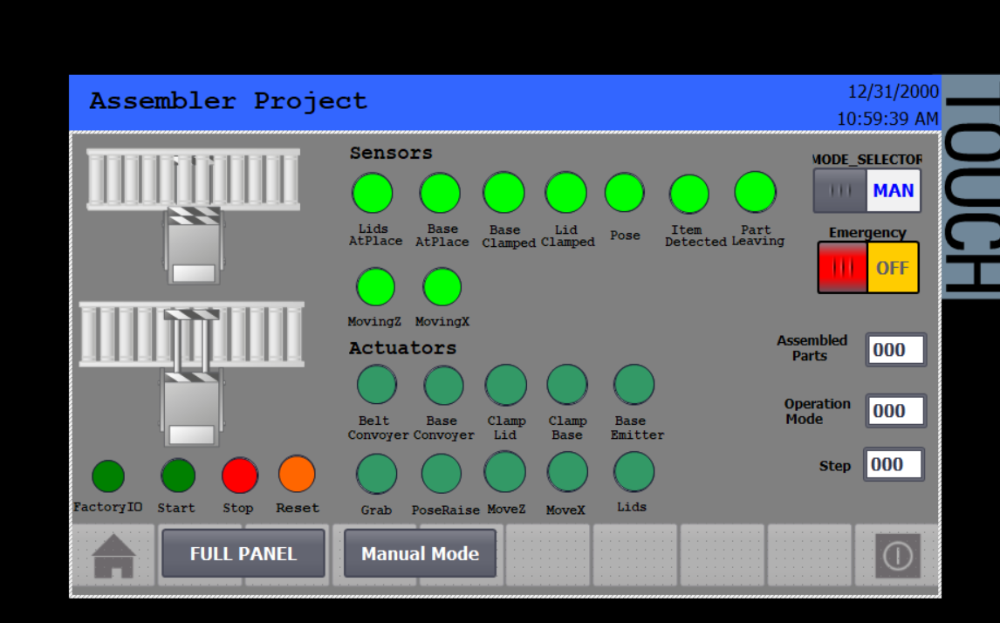
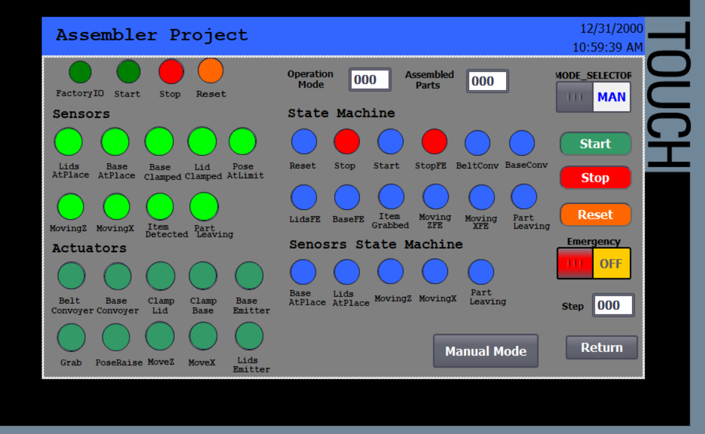
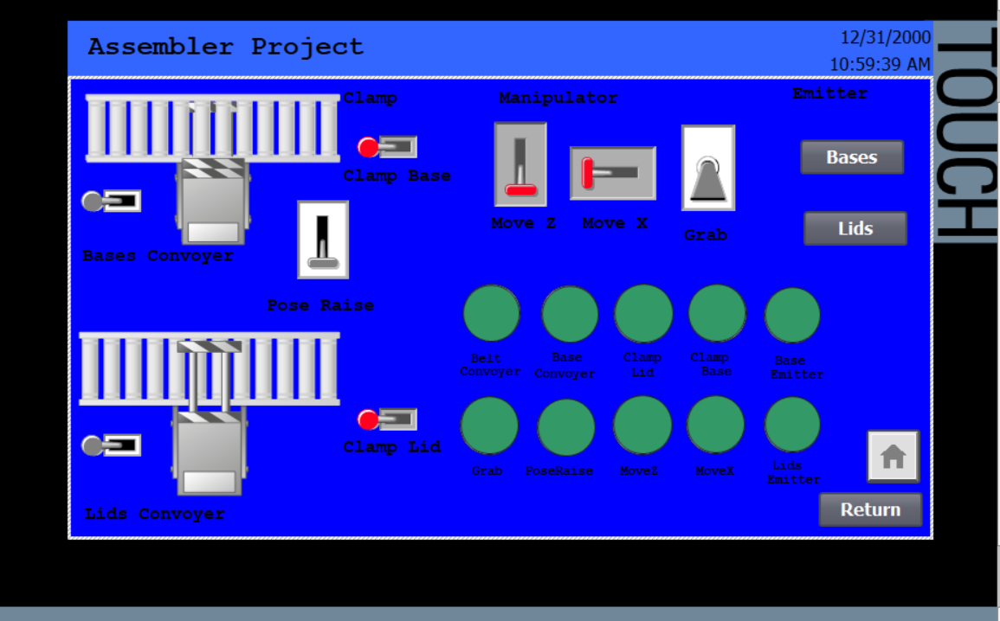

# Assembler Project
> Automated lid-to-base assembly machine — TIA Portal V17 + Factory IO + WinCC Advanced

---
## 🎥 Project Demonstration
See the full sequence including the advanced HMI controls and SCL logic execution:

[](https://www.youtube.com/watch?v=HKS3AyJMBto)

---
## Overview

Full industrial assembly automation built in Siemens SCL, simulated with Factory IO, monitored via WinCC HMI.  
The machine picks lids from a belt conveyor, places them onto bases from a roller conveyor, and outputs assembled parts — fully automated with manual override.

---

## Hardware / Software

| | |
|---|---|
| **PLC** | Siemens S7-1500 (S7-PLCSIM V17) |
| **Programming** | TIA Portal V17 — SCL |
| **Simulation** | Factory IO v2.2.3 — Assembler scene |
| **HMI** | WinCC Advanced V17 — 3 screens |

---

## Project Structure

```
QueueOfItems(CT)_V17/
├── PLC_1/
│   ├── OB1  (Main)
│   ├── FB1  (Assembler_Logic)
│   ├── DB   (Instance DBs, HMI_DB, Snapshot_DB)
│   └── UDTs (SM, Sensors_SM, HMI_LED, Inputs, Snapshots)
└── HMI_1/
    ├── Root Screen     (Navigation + Mode + Emergency)
    ├── Full Panel      (Sensors + Actuators + State Monitor)
    └── Manual Screen   (Direct actuator control)
```
## 🖼️ HMI Interface

### Root Screen


### Full Panel


### Manual Mode

---

## Operation Modes

| Mode | ID | Description |
|---|---|---|
| Emergency | 0 | Freeze all motion, hold actuator positions |
| Stop | 1 | Stop conveyors, hold state, resume on Start |
| Reset | 2 | Clear all flags, return to Step 0 |
| Manual | 3 | Direct HMI/physical control of all actuators |
| Auto | 4 | Full 10-step assembly sequence |

---

## Auto Sequence (10 Steps)

```
Step 0  → Run conveyors, emit parts, wait for both sensors
Step 1  → Stop conveyors, clamp lid and base
Step 2  → Move Z down to pick position
Step 3  → Detect item, release clamp, grab lid
Step 4  → Move Z up, move X over base
Step 5  → Move Z down, place lid on base
Step 6  → Release base clamp
Step 7  → Move Z up (timed release)
Step 8  → Move X back to home
Step 9  → Raise pose, wait for limit sensor
Step 10 → Output assembled part, count, loop to Step 0
```

---

## I/O Summary

**Sensors (9)**
`LidsAtPlace` `BaseAtPlace` `LidClamped` `BaseClamped` `MovingZ` `MovingX` `ItemDetected` `PoseAtLimit` `PartLeaving`

**Actuators (10)**
`BeltConveyor` `BasesConveyor` `ClampLid` `ClampBase` `MoveZ` `MoveX` `Grab` `PoseRaise` `BaseEmitter` `LidsEmitter`

---

## HMI Screens

**Root Screen** — Mode selector (AUTO/MAN), Emergency switch, navigation  
**Full Panel** — Live sensor/actuator LEDs, state machine monitor, step indicator, parts counter  
**Manual Screen** — Individual actuator toggle switches, visual conveyor representation

---

## Key Implementation Details

- All sensor triggers use **F_TRIG** (falling edge) stored as latched flags in `SM` UDT
- **Snapshot UDT** captures actuator states on Emergency/Stop — machine freezes in place
- Timer stabilization uses `ET >= PT - Delay_margin` pattern for process tolerance
- Dual input sources: physical I/O (`Inputs` UDT) OR HMI tags — both always active
- `Delay_Time` and `Delay_margin` are FB parameters — tunable without recompile

---

## Author

**Aoun Adem Tayeb** 
