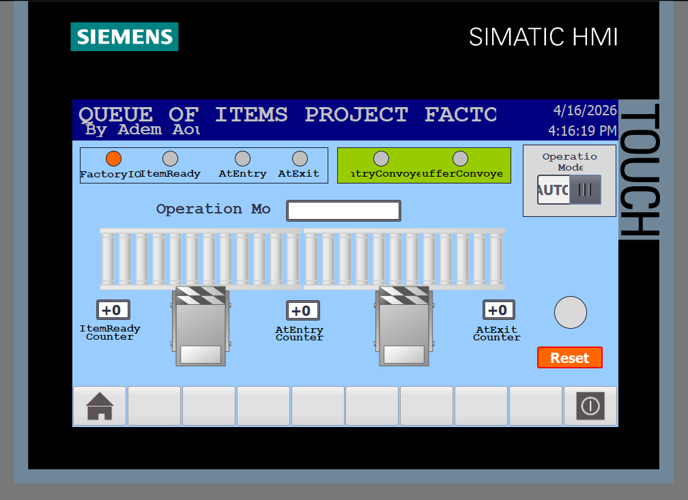
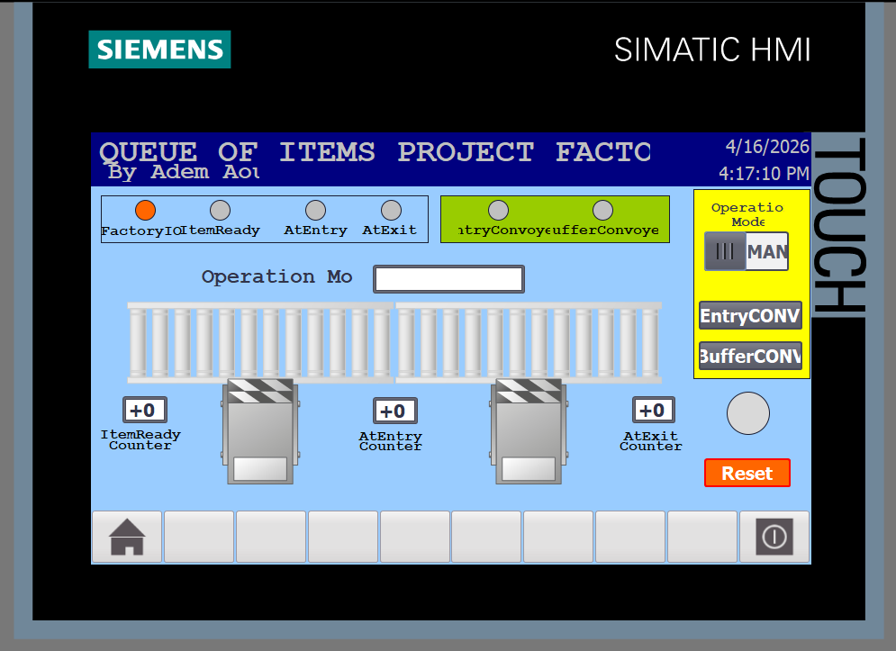

# Queue of Items — Counter Project
> Conveyor queue management with item tracking — TIA Portal V17 + Factory IO + WinCC Advanced

---
## 🎥 Project Demonstration
Check out the system in action, featuring the full automation loop and HMI monitoring:

---
## Overview

Two-conveyor system that tracks items through an entry and exit point using CTU counters.  
Entry conveyor feeds items to the buffer conveyor. The system counts items at three checkpoints and automatically manages conveyor flow based on queue state.

---

## Hardware / Software

| | |
|---|---|
| **PLC** | Siemens S7-1500 (S7-PLCSIM V17) |
| **Programming** | TIA Portal V17 — SCL |
| **Simulation** | Factory IO v2.2.3 — Queue of Items scene |
| **HMI** | WinCC Advanced V17 |

---

## Operation Modes

| Mode | ID | Description |
|---|---|---|
| Manual | 0 | Direct HMI control of both conveyors |
| Auto | 1 | Counter-based automatic flow control |
| Reset | 2 | Clear all counters, stop conveyors → IDLE |
| Idle | 3 | Waiting for operator mode selection |

> Reset has highest priority. Mode selector (AUTO/MAN) controls normal operation.

---

## Auto Logic

**Entry Conveyor:**
- Starts on `ItemReady` rising edge
- Stops when `ItemReadyCount = AtEntryCount` (all queued items have entered)

**Buffer Conveyor:**
- Starts on `AtEntry` rising edge (item arrives at entry)
- Stops when `AtExitCount = AtEntryCount` (all entered items have exited)

---

### HMI Screen

---

## Sensors & Edge Detection

| Signal | Edge | Purpose |
|---|---|---|
| `ItemReady` | R_TRIG | Item ready to enter queue |
| `AtEntry` | F_TRIG | Item left entry sensor → count |
| `AtEntry` | R_TRIG | Item arrived at entry → start buffer |
| `AtExit` | F_TRIG | Item left exit sensor → count |
| `Reset` | R_TRIG | Reset button pulse |

---

## Counters

| Counter | Counts | Resets on |
|---|---|---|
| `Item_Ready_CTU` | Items detected at ready sensor | Reset button |
| `At_Entry_CTU` | Items passed entry sensor | Reset button |
| `At_Exit_CTU` | Items passed exit sensor | Reset button |

---

## HMI

Single screen with:
- Live sensor status LEDs (FactoryIO, ItemReady, AtEntry, AtExit)
- Conveyor status indicators
- 3 item counters (ItemReady, AtEntry, AtExit)
- Mode selector (AUTO / MAN)
- Manual conveyor buttons (visible in Manual mode)
- Operation mode display
- Reset button

---

## Author

**Aoun Adem Tayeb** 
